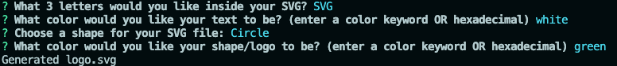

# C10-SVG-Logo-Maker

## Project Description

A command-line application designed to quickly generate simple SVG logos. This tool allows users to create custom logos by simply inputting their desired text and colors.

## Features

- User Input: Prompts for up to three characters of text.
- Color Selection: Allows entry of text and shape colors using color keywords or hexadecimal numbers.
- Shape Selection: Provides a choice of three shapes - Circle, Triangle, and Square.
- SVG Generation: Automatically generates an SVG file named logo.svg based on user inputs.

## Usage

1. Clone the repository: `git clone https://github.com/Lixiviate/C10-SVG-Logo-Maker.git`
2. Install the necessary dependencies: `npm install`
3. Run the application: `npm start`
4. Follow the prompts to enter text, select colors, and choose a shape.
5. The generated logo.svg file will be saved in the project directory.

## Example(s)

[Walkthrough Video]()

**CLI Example:**

**SVG Example:**

## Source Code

- Created by [Lixiviate](https://github.com/Lixiviate)
- Code assistance from:
  - [MDN Web Docs](https://developer.mozilla.org/en-US/)
  - [W3Schools](https://www.w3schools.com/)
  - [edX Xpert Learning Assistant](https://www.edx.org/)

## License

This project is licensed under the MIT license.
